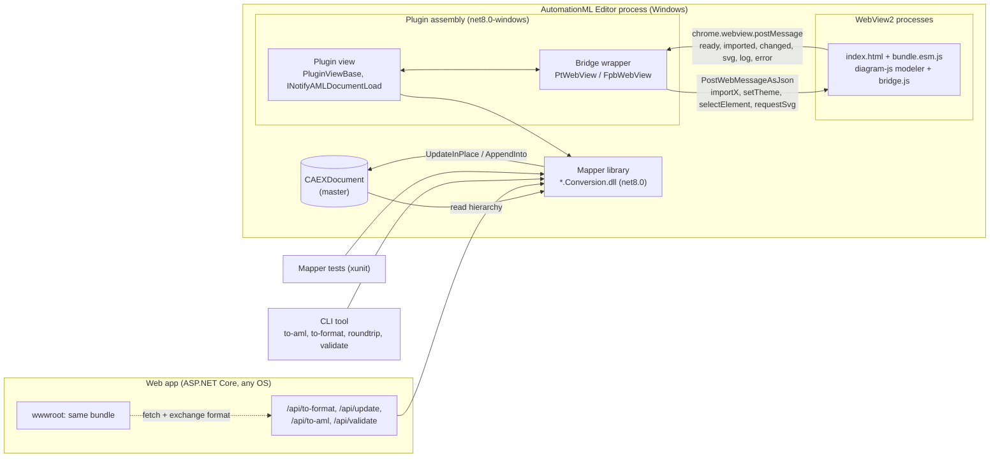
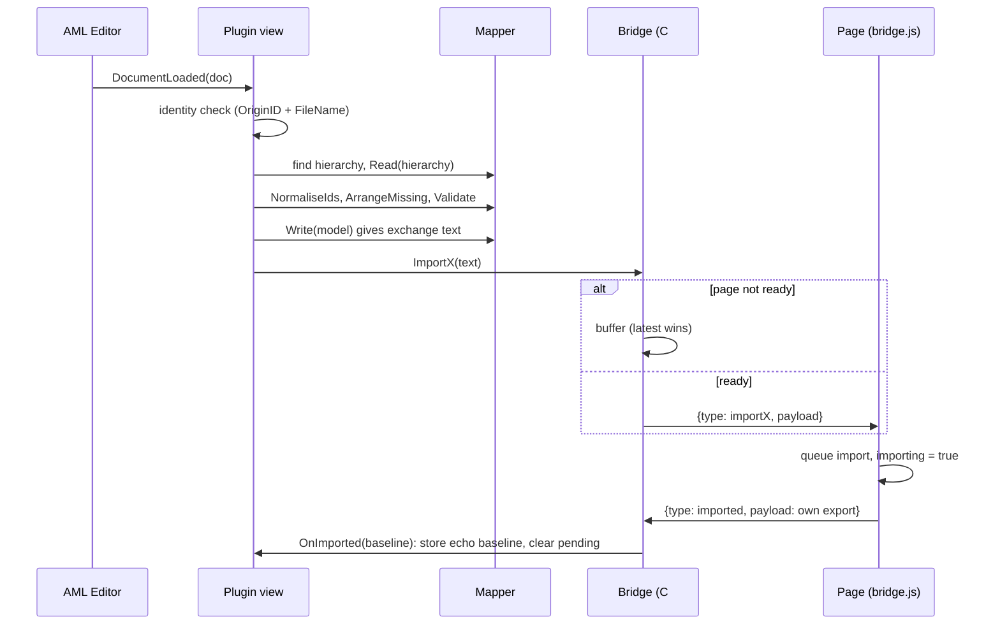

# 01 Architecture of an AML language plugin

## In short

- Build five deliverables around one mapper library: modeler bundle, exchange format, mapper, editor plugin, and optionally web app and CLI (see §1). The starter has all of them.
- The mapper is its own `net8.0` project that references only Aml.Engine; plugin, web app, CLI and tests all call it. Validator and conformance report live there too, not in the plugin (see §2).
- JavaScript knows the diagram and the exchange format, never CAEX; C# knows AML, never rendering (see §3).
- The exchange text is transient. The AML document is the master: Update goes through update in place with all preconditions checked first; appending a new hierarchy is an explicit plugin decision (see §4, §6).
- Ready means the page posted `ready`. Buffer pushes until then (latest wins), reset ready on `NavigationStarting` and `ProcessFailed`, reload after a renderer crash, and let the host's `Ready` handler win over an older buffered push (see §5.4).
- Echo detection is by content: the page answers every successful import with `imported` plus its own export (a failed one with `error` only), and the host ignores a `changed` equal to it. Send the full model, debounced; queue imports in JavaScript (see §5.2, §5.4).
- Questions with answers (SVG) use a `TaskCompletionSource` with a timeout (see §5.3).
- One WebView2 per plugin view with a model picker; no teardown on `Unloaded`; never raise `IsDocumentLoaded` (see §7).
- Start with a manual Refresh button, not polling (see §4.4).
- Packaging: `BaseOutputPath` anchored at the csproj, `Aml.Editor.Plugin.Contract.dll` never shipped, mapper DLL and `WebView2Loader.dll` packed explicitly, build fails without the bundle, version equal in csproj and `Metadata.xml` (see §9.1, §9.2).
- Ship one ESM file, one CSS file and `index.html`, minification off, nothing from a CDN (see §9.3).

Read fully when: you create the repository layout, or you change how plugin, mapper, modeler and web app talk to each other.
Skim when: you start from the starter and only need one protocol rule or one packaging item; jump to §5 or §9.

---

This chapter describes how the pieces of a "graphical language in AutomationML" stack fit together: the browser modeler, the exchange format, the .NET mapper on Aml.Engine, the WPF plugin that hosts the modeler in WebView2 inside the AutomationML Editor, and the optional web application and command line tool that reuse the mapper. It covers what runs where, how data moves in both directions, the message protocol between WebView2 and JavaScript, why the AML document stays the master, and how the plugin is versioned and packaged. Read it before creating any project or folder: most of the expensive mistakes in the two source projects (AMLFPB.js plus fpb-aml-mapper for VDI 3682, AMLPetriNet for ISO/IEC 15909 P/T nets) were architectural, and they are cheap to avoid on day one and expensive to fix later. Details of each component follow in [02 Modeler](02-modeler-diagram-js.md), [03 Exchange format](03-exchange-format.md), [04 AML mapping](04-aml-mapping.md), [05 Editor plugin](05-editor-plugin.md) and [06 Web app](06-web-app.md).

Recommendation in one line: **copy the AMLPetriNet architecture** (one repository, one solution, bundle built in the same repository, one WebView2 per plugin view, mapper library free of UI, validator in the mapper, web app and CLI on the same library), and take the individual hard-won fixes from AMLFPB.js where AMLPetriNet has not needed them yet (live sync with conflict backup, `_rebuildGeneration` token if you ever build several views).

---

## 1. Component split

### What to do

Build five deliverables around one library:

| Component | Runs in | Technology | Responsibility | AMLPetriNet | AMLFPB.js / fpb-aml-mapper |
|---|---|---|---|---|---|
| Modeler bundle | Browser (WebView2 or any browser) | diagram-js based modeler, bundled to one ESM file | Drawing, editing, interaction rules, serialising the diagram to the exchange format, host bridge | `web/` (esbuild bundle of `@bptlab/openbpt-modeler-petri-net` plus `src/bridge.js` and a PNML converter) | separate repo FPB.JS, `dist/fpbjs.esm.js`, plus `fpbjs-assets/index.html` in the plugin repo |
| Exchange format | Wire between browser and .NET | Text document | The only thing the two halves share | PNML (ISO/IEC 15909-2) | FPB.js JSON |
| Mapper library | .NET 8, any OS | `net8.0` class library, Aml.Engine 4.x | Exchange format to CAEX and back, update in place, validation, layout of missing geometry, domain libraries, reports | `dotnet/PtMapper.Conversion` | `fpb-aml-mapper/dotnet/FpbMapper.Conversion` |
| Editor plugin | AutomationML Editor process, Windows | `net8.0-windows7.0`, WPF, WebView2 | Document lifecycle, hosting the page, bridge, pending edits, Update/Refresh buttons, findings UI, dialogs | `Aml.Editor.Plugin.PetriNet` | `fpb-aml-editor-plugin/Aml.Editor.Plugin.FPB` |
| Web app (optional) | ASP.NET Core 8 | Minimal API plus static files | The mapper over HTTP, with the same modeler bundle on a page | `dotnet/PtMapper.Web` | `dotnet/FpbMapper.Web` (API only) plus `server.js` (Node proxy and static page) |
| CLI (optional) | .NET 8 console | `dotnet run` or a tool | Batch conversion, round-trip checks, validation with exit codes, regenerating paper and test artefacts | `dotnet/PtMapper.Tool` (`ptmap`) | none |

The starter covers every row for the toy language EFL: `starter/web/` (modeler and bridge), JSON as exchange format (`starter/dotnet/Efl.Conversion/EflJson.cs`), `starter/dotnet/Efl.Conversion/` (mapper), `starter/plugin/Aml.Editor.Plugin.Efl/` (plugin), `starter/dotnet/Efl.Web/` (web app) and `starter/dotnet/Efl.Tool/` (CLI `eflmap` with `to-aml`, `to-json`, `update`, `validate`, `library` and `arrange`, listed at `starter/dotnet/Efl.Tool/Program.cs:1-14`; every command that writes prints what it wrote).

The mapper project targets plain `net8.0` and references only Aml.Engine (`AMLPetriNet: dotnet/PtMapper.Conversion/PtMapper.Conversion.csproj:3`, `fpb-aml-mapper: dotnet/FpbMapper.Conversion/FpbMapper.Conversion.csproj:3`). The plugin targets `net8.0-windows7.0` with WPF and dynamic loading (`AMLPetriNet: Aml.Editor.Plugin.PetriNet/Aml.Editor.Plugin.PetriNet.csproj:4-8`). Keep it that way: the moment the mapper references WPF or WebView2, the web app cannot run on a Linux host and the tests need Windows.

### Diagram



---

## 2. One repository, separate projects

### What to do

Put modeler bundle, mapper, plugin, web app, CLI, tests, libraries and examples into **one repository with one solution**, but keep the mapper a **separate project** that everything else references.

```
AMLPetriNet: Aml.Editor.Plugin.PetriNet.sln:6-16
  Aml.Editor.Plugin.PetriNet
  dotnet/PtMapper.Conversion
  dotnet/PtMapper.Tests
  dotnet/PtMapper.Tool
  dotnet/PtMapper.Web
```

### Why separate projects

The mapper is the single source of truth for "what does this language look like in AML". Three consumers must agree with it byte for byte:

- The plugin calls it for every load and every Update (`AMLPetriNet: Aml.Editor.Plugin.PetriNet/PetriNetPlugin.xaml.cs:475`, `:646`).
- The web app calls the same functions over HTTP (`AMLPetriNet: dotnet/PtMapper.Web/Program.cs:202`); its header comment states the intent: "the same conversion library the AML Editor plugin uses" (`AMLPetriNet: dotnet/PtMapper.Web/Program.cs:1-3`).
- The CLI and the tests exercise it without the editor (`AMLPetriNet: dotnet/PtMapper.Tool/Program.cs:1-15`).

If the conversion lived in the plugin, none of these could run it without loading WPF, and the web demo would silently drift from the plugin.

Put the **validator and the conformance report in the mapper too**. AMLPetriNet does (`PtValidator`, `PtConformanceReport` in `dotnet/PtMapper.Conversion`), so the same rules run in the plugin, in `POST /api/validate` (`AMLPetriNet: dotnet/PtMapper.Web/Program.cs:216-238`) and in `ptmap validate`. AMLFPB.js keeps its C# rule classes and the report builder in the plugin project (`AMLFPB.js: Aml.Editor.Plugin.FPB/Validation/Vdi3682Validator.cs:38`), while only the OCL rule files are embedded in the mapper (`fpb-aml-mapper: dotnet/FpbMapper.Conversion/FpbMapper.Conversion.csproj:10-22`). Result: the FPD web API has no validation endpoint, and validation tests have to reference the WPF plugin.

### Why one repository

AMLFPB.js is split over three repositories plus OCL.NET, joined by relative paths. The plugin csproj reaches into siblings (`AMLFPB.js: Aml.Editor.Plugin.FPB/Aml.Editor.Plugin.FPB.csproj:19-20`, `:50-63`), the test project needs its own direct reference to the mapper because the plugin's reference is `PrivateAssets=all` (`AMLFPB.js: Aml.Editor.Plugin.FPB.Tests/Aml.Editor.Plugin.FPB.Tests.csproj:22-25`), and CI has to reproduce the local folder layout with four checkouts (`AMLFPB.js: .github/workflows/build.yml:17-48`). The FPB.JS checkout carries no `ref`, so a release build takes whatever the modeler's default branch holds at that moment (`AMLFPB.js: .github/workflows/build.yml:38-42`). The mapper repository also carries leftovers of an earlier Node implementation that nobody noticed: `package.json` still points `main` and two scripts at an `index.js` that no longer exists (`fpb-aml-mapper: package.json:5-10`).

AMLPetriNet builds everything from one checkout: bundle first, then the solution, then both test suites (`AMLPetriNet: .github/workflows/ci.yml:31-52`). The modeler dependency is pinned exactly (`AMLPetriNet: web/package.json:21`).

Exception: if the modeler is a product in its own right with its own users (FPB.JS is published on npm and runs fpbjs.net), keep it in its own repository, but then consume a **pinned version** (npm version or git tag), never a sibling working copy.

---

## 3. What lives in the browser and what lives in .NET

### Rule

The browser knows the diagram and the exchange format. .NET knows AML. Nothing about CAEX, InstanceHierarchies, class paths or AML ids appears in JavaScript; nothing about rendering or interaction appears in C#.

| Concern | Browser | .NET mapper | .NET plugin |
|---|---|---|---|
| Rendering, palette, context pad, interaction rules | yes | | |
| Serialise diagram to exchange format, parse it back | yes (`AMLPetriNet: web/src/pnml/index.js`, aliased into the modeler at `web/build.mjs:53-59`) | yes, a second implementation (`AMLPetriNet: dotnet/PtMapper.Conversion/Pnml.cs:38`, `:316`) | |
| Debouncing edits, suppressing import fallout | yes (`AMLPetriNet: web/src/bridge.js:124-155`) | | compares content with the echo baseline |
| SVG picture of the diagram | yes (`web/src/svg.js`) | | saves the file |
| Read AML into the model, write the model into AML | | yes | calls it |
| Update in place, identity, library embedding | | yes | |
| Id normalisation for the canvas, auto layout of missing geometry | | yes (`PtIdText`, `PtLayout`) | calls it before every push (`AMLPetriNet: Aml.Editor.Plugin.PetriNet/PetriNetPlugin.xaml.cs:863-876`) |
| Structural validation, conformance report | | yes (recommended) | shows findings, double-click selects element |
| Document lifecycle, file dialogs, confirmations, editor save | | | yes |

Two implementations of the exchange format (JS and C#) are unavoidable, since the modeler must load and save without the host and the mapper must parse what the modeler sends. Guard their agreement with round-trip tests on both sides ([07 Testing](07-testing-and-ci.md)); AMLPetriNet runs the PNML round trip and interop fixtures in Chromium (`AMLPetriNet: web/package.json:10`) and the C# round trip in xunit.

Aml.Engine is not thread-safe; all mapper calls in the plugin run on the UI thread (`AMLFPB.js: Aml.Editor.Plugin.FPB/Views/IhView.xaml.cs:284-287`). Do not "optimise" an Update by moving it to a background task.

---

## 4. Data flow

The exchange format document is transient. It is produced on demand from the AML document, lives on the canvas and in one "pending" string in the plugin, and is written back into AML only when the user presses Update. It is never saved as a second source of truth.

### 4.1 Open (AML to canvas)



Sources: `AMLPetriNet: Aml.Editor.Plugin.PetriNet/PetriNetPlugin.xaml.cs:298-320` (DocumentLoaded), `:382-413` (AttachDocument), `:471-519` (PushToModeler), `AMLPetriNet: Aml.Editor.Plugin.PetriNet/Bridge/PtWebView.cs:172-184` (buffer or post), `AMLPetriNet: web/src/bridge.js:159-200` (queued import, `imported` with own export), `AMLPetriNet: Aml.Editor.Plugin.PetriNet/PetriNetPlugin.xaml.cs:184-197` (baseline).

### 4.2 Edit (canvas to pending)

1. diagram-js fires `commandStack.changed`. The bridge ignores it while importing or simulating, otherwise debounces 300 ms, exports, and posts `changed` (`AMLPetriNet: web/src/bridge.js:26`, `:148-157`).
2. The plugin compares the payload with the echo baseline by exact string equality. Equal means import fallout; different means a user edit, stored as `_pendingPnml` with an "unsaved diagram changes" label, and revalidated without popping the findings panel open (`AMLPetriNet: Aml.Editor.Plugin.PetriNet/PetriNetPlugin.xaml.cs:233-255`).

Nothing touches the AML document during editing.

### 4.3 Update (pending to AML)

1. Parse the pending text (`AMLPetriNet: Aml.Editor.Plugin.PetriNet/PetriNetPlugin.xaml.cs:626`).
2. Ask before a large change, counted on added and removed ids so moves and renames do not ask (`:1125-1146`).
3. If the bound hierarchy exists: `UpdateInPlace`; otherwise `AppendInto` (`:639-647`).
4. Clear pending and baseline, revalidate, log the summary and its notes (`:650-660`).
5. Invoke the editor's own save command by reflection when the `SaveAfterUpdate` setting is on (`:662-672`). It is on by default (`AMLPetriNet: Aml.Editor.Plugin.PetriNet/Diagnostics/PluginSettings.cs:15-20`), because the contract cannot mark the document as changed and an unsaved update is lost when the editor closes; users who want to undo an update by closing the document without saving turn it off. The starter has the same setting with the same default (`starter/plugin/Aml.Editor.Plugin.Efl/Diagnostics/PluginSettings.cs:15-20`).

### 4.4 External AML edits (AML to canvas, later)

Two strategies exist:

- **Manual Refresh** (AMLPetriNet): the user presses Refresh; if there are pending edits, a confirmation first (`AMLPetriNet: Aml.Editor.Plugin.PetriNet/PetriNetPlugin.xaml.cs:685-707`).
- **Polling live sync** (AMLFPB.js): a `DispatcherTimer` hashes the hierarchy XML with SHA-256 every 2 s (`AMLFPB.js: Aml.Editor.Plugin.FPB/Views/IhView.xaml.cs:48`, `:742-749`). On a change with pending edits, the pending snapshot is written to a backup file in `%TEMP%` and dropped, then the canvas reloads (`:675-716`). Update suppresses the timer for its whole duration, confirmation dialogs included, because `MessageBox.Show` pumps the dispatcher (`:261-267`).

Recommendation: start with manual Refresh. Aml.Engine has no public change event (`AMLFPB.js: README.md:104`), so polling costs a full serialisation per view per tick on the UI thread. Add polling only when users ask for it, and then copy the AMLFPB.js conflict handling (backup before discard, suppression during Update).

### 4.5 Export and import of files

- Export the exchange format from **what the user sees**: pending edits if any, otherwise the document, prepared the same way the canvas got it (`AMLPetriNet: Aml.Editor.Plugin.PetriNet/PetriNetPlugin.xaml.cs:883-905`, `:1028-1059`). AMLFPB.js exports from the document only (`AMLFPB.js: Aml.Editor.Plugin.FPB/Views/IhView.xaml.cs:533-557`), so unsaved canvas edits are missing from the file. The starter exports the pending text if there is one, else the stored diagram after `ArrangeMissing` (`starter/plugin/Aml.Editor.Plugin.Efl/EflPlugin.xaml.cs:572-590`).
- Import a file as a new hierarchy: read all models the file holds, arrange missing layout **before** writing so the document never holds geometry-free elements, append with a unique hierarchy name, bind and push (`AMLPetriNet: Aml.Editor.Plugin.PetriNet/PetriNetPlugin.xaml.cs:932-976`).
- SVG export is a request with an answer, see section 5.3 (`:991-1026`).

### 4.6 Web app flow

The same four directions over HTTP, with the page holding the AML text instead of the editor holding a `CAEXDocument`: `to-pnml` (AML in, exchange format out), `update` (AML plus exchange format in, **the same AML document** out), `to-aml` (exchange format in, new document out, lossy by definition), `validate` (`AMLPetriNet: dotnet/PtMapper.Web/Program.cs:106-238`). The lossless path is `update`; the header comment says so explicitly (`:8-13`). The FPD web API offers only `to-aml` and `to-json` (`fpb-aml-mapper: dotnet/FpbMapper.Web/Program.cs:24`, `:56`), so a round trip through the website regenerates the document and loses everything the language does not own. The starter's web app follows AMLPetriNet: `POST /api/to-json`, `/api/to-aml?style=link|element`, `/api/update` (lossless), `/api/validate`, `GET /api/library`, `/api/library/layout` (the OMG_DD file the library references) and `/api/health` (`starter/dotnet/Efl.Web/Program.cs:41`, `:64`, `:83`, `:107`, `:129`, `:137`, `:143`). See [06 Web app](06-web-app.md).

---

## 5. Bridge protocol between WebView2 and JavaScript

### 5.1 Transport

- C# to page: `CoreWebView2.PostWebMessageAsJson(JsonSerializer.Serialize(envelope))` (`AMLPetriNet: Aml.Editor.Plugin.PetriNet/Bridge/PtWebView.cs:239-240`). Serialise an object; never concatenate JSON strings. For a JSON payload, parse it first so invalid mapper output fails in C# with a clear message (`AMLFPB.js: Aml.Editor.Plugin.FPB/Bridge/FpbWebView.cs:155-169`).
- Page to C#: `window.chrome.webview.postMessage(object)`, received as `WebMessageAsJson` and deserialised into one DTO with optional fields (`AMLPetriNet: Aml.Editor.Plugin.PetriNet/Bridge/BridgeMessage.cs:10-23`).
- Page listens with `window.chrome.webview.addEventListener('message', e => e.data)` (`AMLPetriNet: web/src/bridge.js:188`).
- The page is served from a virtual host mapped to the plugin's asset folder, `https://ptnjs.local/index.html` (`AMLPetriNet: Aml.Editor.Plugin.PetriNet/Bridge/PtWebView.cs:119-121`, `:157`), so ES modules and CSS load without `file://` restrictions.
- Keep message type tags as constants on both sides (`AMLPetriNet: Aml.Editor.Plugin.PetriNet/Bridge/BridgeMessage.cs:26-42`, documented at the top of `web/src/bridge.js:8-22`).

### 5.2 Message types

| Direction | Type | Payload | Purpose | PT | FPD |
|---|---|---|---|---|---|
| host to page | `importPNML` / `importJSON` | `pnml` / `data` | Replace the diagram | yes | yes |
| host to page | `setTheme` | `theme` (`light` or `dark`) | Follow the editor skin | yes | yes |
| host to page | `selectElement` | `id` | Select and scroll to an element (findings double-click) | yes | yes |
| host to page | `requestExport` | none | Ask for the current model now | yes | no |
| host to page | `requestSvg` | none | Ask for a picture; answered by `svg` | yes | no |
| page to host | `ready` | `url` | Handshake; the only point after which posts are safe | yes | yes |
| page to host | `imported` | own export of the imported model | Echo baseline | yes | yes |
| page to host | `changed` | full model | User edit | yes (debounced) | yes (every change) |
| page to host | `svg` | `svg` | Answer to `requestSvg` | yes | no |
| page to host | `processSwitched` | `id` | Layer switch in the modeler | no | yes |
| page to host | `log` | `level`, `message` | Forwarded console, `window.error`, `unhandledrejection` | yes | yes |
| page to host | `error` | `message` | Failure the user should see | yes | yes |

The starter uses the same set with the payload renamed to the language: `importModel` with `model`, and `imported` carrying `model` plus the reader's `warnings` (`starter/web/src/bridge.js:8-21`; C# constants in `starter/plugin/Aml.Editor.Plugin.Efl/Bridge/BridgeMessage.cs`). `requestExport` is answered with a `changed` message in both AMLPetriNet and the starter (`starter/web/src/bridge.js:137-141`).

Always send the **full model** in `changed`, not a delta. The plugin then only has to remember one string, and the mapper's update in place computes the difference against the document.

### 5.3 Request and response

Most traffic is fire-and-forget events. When the host needs an answer (a picture for a save dialog), use a `TaskCompletionSource` with a timeout:

```csharp
// AMLPetriNet: Aml.Editor.Plugin.PetriNet/Bridge/PtWebView.cs:201-217
public async Task<string?> RequestSvgAsync(TimeSpan timeout)
{
    if (_disposed || !_ready || _view.CoreWebView2 == null) return null;

    var answer = new TaskCompletionSource<string?>(TaskCreationOptions.RunContinuationsAsynchronously);
    _svgRequest = answer;
    try
    {
        Post(new { type = JsMessageType.RequestSvg });
        var finished = await Task.WhenAny(answer.Task, Task.Delay(timeout)).ConfigureAwait(true);
        return finished == answer.Task ? await answer.Task.ConfigureAwait(true) : null;
    }
    finally
    {
        _svgRequest = null;
    }
}
```

The handler completes it with `_svgRequest?.TrySetResult(message.Svg)` (`AMLPetriNet: Aml.Editor.Plugin.PetriNet/Bridge/PtWebView.cs:275-277`). Keep these properties:

- `RunContinuationsAsynchronously`, so the continuation does not run inside the WebView2 event handler.
- A timeout returning null, because a crashed renderer never answers and an awaiting dialog would look like a hung editor (comment at `:193-200`).
- `ConfigureAwait(true)`: the caller touches WPF afterwards.

The single `_svgRequest` slot means a second concurrent request replaces the first, which then times out. That is acceptable for one button. If you add more request types, add a `requestId` to both envelopes and keep a dictionary of pending completions.

### 5.4 Ready handshake and buffering

These rules come from bugs both projects hit:

1. **Ready means the page said so.** Set `_ready = true` only on the `ready` message, never after `Navigate()` or `NavigationCompleted`. Before the page's listener exists, `PostWebMessageAsJson` is dropped silently (`AMLFPB.js: Aml.Editor.Plugin.FPB/Bridge/FpbWebView.cs:19-25`, `AMLPetriNet: Aml.Editor.Plugin.PetriNet/Bridge/PtWebView.cs:260-265`).
2. **The page posts `ready` last**, after the modeler is created and the listener is attached (`AMLPetriNet: web/src/bridge.js:239`, `AMLPetriNet: web/index.html:66-83`).
3. **Buffer until ready.** Model pushes and theme are kept in single slots (latest wins) and flushed on `ready` (`AMLPetriNet: Aml.Editor.Plugin.PetriNet/Bridge/PtWebView.cs:172-184`, `:293-305`). `ImportX` returns whether it posted or buffered; AMLFPB.js arms its timed echo window only when it really posted, because a window opened for a buffered push swallowed a genuine edit (`AMLFPB.js: Aml.Editor.Plugin.FPB/Bridge/FpbWebView.cs:135-141`, `AMLFPB.js: Aml.Editor.Plugin.FPB/Views/IhView.xaml.cs:204-222`).
4. **Leave ready on every navigation and on renderer failure.** `NavigationStarting` resets `_ready` (F5 in the context menu reloads the page); `ProcessFailed` resets it too (`AMLPetriNet: Aml.Editor.Plugin.PetriNet/Bridge/PtWebView.cs:131-148`). AMLPetriNet additionally reloads the page after a render process exit; AMLFPB.js only shows a message asking for Refresh (`AMLFPB.js: Aml.Editor.Plugin.FPB/Bridge/FpbWebView.cs:106-113`). Copy the reload.
5. **Every boot restores state.** The host's `Ready` handler runs on the first boot, after F5 and after crash recovery: unsaved edits win over the document, the theme is re-sent, and a push already buffered is left to the flush (`AMLPetriNet: Aml.Editor.Plugin.PetriNet/PetriNetPlugin.xaml.cs:202-225`). Note that both source bridges raise `Ready` before `FlushPending` (`AMLPetriNet: Aml.Editor.Plugin.PetriNet/Bridge/PtWebView.cs:263-264`, `AMLFPB.js: Aml.Editor.Plugin.FPB/Bridge/FpbWebView.cs:231-232`), so a buffered push lands after anything the `Ready` handler posts and can overwrite it; `AMLFPB.js: Aml.Editor.Plugin.FPB/Views/IhView.xaml.cs:129-134` pushes unconditionally in its handler. The starter fixes the order: it takes the buffered model out before calling the handler and sends it only if the handler imported nothing (`starter/plugin/Aml.Editor.Plugin.Efl/Bridge/ModelerView.cs:221-238`). Its `Ready` handler therefore needs no check for a buffered push: it always sends the unsaved edits or reads the document afresh (`starter/plugin/Aml.Editor.Plugin.Efl/EflPlugin.xaml.cs:126-146`). Copy that.
6. **Create the bridge object in the view constructor**, boot WebView2 in `Loaded`. The editor can call `DocumentLoaded` before the view is loaded, and a null bridge dropped that model (`AMLPetriNet: Aml.Editor.Plugin.PetriNet/PetriNetPlugin.xaml.cs:124-127`, `:163-200`).
7. **Serialise imports in JavaScript.** Two imports close together interleave at the `await` and the second import's command stack traffic is reported as user edits (`AMLPetriNet: web/src/bridge.js:192-200`).
8. **Echo detection by content, not by time.** The page answers every import with its own export; a later `changed` equal to that string is fallout. AMLFPB.js started with a 3 s window (`AMLFPB.js: Aml.Editor.Plugin.FPB/Views/IhView.xaml.cs:49-52`) and kept it only as a fallback; its JS settles the import with two animation frames plus a `setTimeout` fallback, because WebView2 pauses `requestAnimationFrame` in hidden tabs and the import flag stuck forever (`AMLFPB.js: Aml.Editor.Plugin.FPB/fpbjs-assets/index.html:275-299`).
9. **Forward the console.** Patch `console.*`, `window.error` and `unhandledrejection` into `log` messages; the host writes them to its log file and gates debug levels behind a setting (`AMLPetriNet: web/src/bridge.js:65-99`, `AMLPetriNet: Aml.Editor.Plugin.PetriNet/PetriNetPlugin.xaml.cs:175-183`). Leave DevTools enabled (`AMLPetriNet: Aml.Editor.Plugin.PetriNet/Bridge/PtWebView.cs:95-98`).
10. **Verify assets before navigating** and report a missing folder or bundle by name (`AMLPetriNet: Aml.Editor.Plugin.PetriNet/Bridge/PtWebView.cs:100-117`), and run a startup check that logs whether assets, Aml.Engine, WebView2 and System.Text.Json resolve (`AMLPetriNet: Aml.Editor.Plugin.PetriNet/Diagnostics/StartupCheck.cs:21-30`).

The bridge can be tested without WebView2: install a stand-in `window.chrome.webview` with Playwright's `addInitScript` and drive the real protocol (`AMLPetriNet: web/tools/verify-bridge.mjs:30-43`). The starter's `connectBridge` returns its message handler so a test or a plain web page can drive it directly (`starter/web/src/bridge.js:170-171`); `starter/web/tools/verify-bridge.mjs` runs six protocol checks that way (ready, import baseline without a change, one debounced change per edit, back-to-back imports, broken import answered with `error` and no `imported`, export/SVG/selection requests). See [05 Editor plugin](05-editor-plugin.md) and [07 Testing](07-testing-and-ci.md).

---

## 6. The AML document stays the master

### What to do

Never regenerate the language's InstanceHierarchy from the exchange format. Match elements by the language's own id and write only what the language owns.

```csharp
// AMLPetriNet: dotnet/PtMapper.Conversion/PtNetUpdater.cs:22-36 (summary)
// Brings an existing PT instance hierarchy in line with a net, instead of
// replacing it. [...] a user may have added attributes to an element, linked a
// place to a station in another hierarchy, or pointed a refObj at an arc.
// Replacing the hierarchy throws all of that away on every sync. This matches
// elements by their PNML id, writes only what the language owns, and leaves
// everything else alone.
```

The same shape is in the starter (`starter/dotnet/Efl.Conversion/EflUpdater.cs:14-28`) and in the FPD mapper (`fpb-aml-mapper: dotnet/FpbMapper.Conversion/FpbJsonToCaex.cs:105-116`, called from `AMLFPB.js: Aml.Editor.Plugin.FPB/Views/IhView.xaml.cs:308`).

### The guarantees that make "master" true

| Guarantee | How | Source |
|---|---|---|
| Foreign attributes, links and elements survive | Update in place, language-owned attribute list | `AMLPetriNet: dotnet/PtMapper.Conversion/PtNetUpdater.cs:32-35` |
| No half-written document | All preconditions (duplicate ids, arc ends, carried classes) checked before the first write | `AMLPetriNet: dotnet/PtMapper.Conversion/PtNetUpdater.cs:56-64`, `starter/dotnet/Efl.Conversion/EflUpdater.cs:37-41` |
| An attribute edit does not embed libraries into a document that references them | Libraries created lazily, only when an element must be instantiated | `AMLPetriNet: dotnet/PtMapper.Conversion/PtNetUpdater.cs:121-133` |
| A renamed hierarchy is followed, not duplicated | Bind by hierarchy id, name only as fallback | `AMLPetriNet: Aml.Editor.Plugin.PetriNet/PetriNetPlugin.xaml.cs:30-39`, `:431-453` |
| A new editor wrapper for the same file does not reload the canvas | Identity by `OriginID` plus `FileName`; `OriginID` alone names the authoring tool and is equal across editor-saved files. The starter does the same and treats two unsaved documents without a file name as different (`starter/plugin/Aml.Editor.Plugin.Efl/EflPlugin.xaml.cs:220-237`) | `AMLPetriNet: Aml.Editor.Plugin.PetriNet/PetriNetPlugin.xaml.cs:307-344`, `AMLFPB.js: Aml.Editor.Plugin.FPB/FpbPlugin.xaml.cs:66-71` |
| A stale diagram does not delete half the model | Confirmation above a threshold of added plus removed ids | `AMLPetriNet: Aml.Editor.Plugin.PetriNet/PetriNetPlugin.xaml.cs:1117-1146` |
| Document ids stay as they are | Ids normalised for the canvas only; the document keeps its own | `AMLPetriNet: Aml.Editor.Plugin.PetriNet/PetriNetPlugin.xaml.cs:849-868` |
| The user decides when the file is saved | A `SaveAfterUpdate` setting (on by default) that runs the editor's save command by reflection; off leaves saving to Ctrl+S | `AMLPetriNet: Aml.Editor.Plugin.PetriNet/PetriNetPlugin.xaml.cs:662-672`, `AMLPetriNet: Aml.Editor.Plugin.PetriNet/Bridge/EditorSaver.cs:20-34` |

Compare with the FPD mapper, which calls `EnsureLibraries` on every update (`fpb-aml-mapper: dotnet/FpbMapper.Conversion/FpbJsonToCaex.cs:171-172`) and silently falls back to appending a fresh hierarchy when it finds none (`:174-181`); AMLPetriNet makes the append an explicit decision of the plugin (`AMLPetriNet: Aml.Editor.Plugin.PetriNet/PetriNetPlugin.xaml.cs:639-643`).

The plugin contract has no "document changed" or "mark dirty" call, which is why saving goes through the editor's command (`AMLPetriNet: Aml.Editor.Plugin.PetriNet/Bridge/EditorSaver.cs:1-11`). Measure what a sync changes against the same file loaded and saved once without changes, not against the original file, or you measure Aml.Engine's reformatting. Mapping rules in detail: [04 AML mapping](04-aml-mapping.md).

---

## 7. Plugin view topology: one WebView2 per view

AMLFPB.js creates one sub-tab with its own `IhView`, `FpbWebView` and WebView2 for every FPD InstanceHierarchy (`AMLFPB.js: Aml.Editor.Plugin.FPB/FpbPlugin.xaml.cs:425-457`). That cost:

- a rebuild on every document callback, which awaits WebView2 init per hierarchy and needed a generation token so a stale rebuild does not add ghost tabs for a closed document (`AMLFPB.js: Aml.Editor.Plugin.FPB/FpbPlugin.xaml.cs:49-56`, `:413`, `:430-434`, `:463-468`);
- a per-document pending-edit cache so edits survive tab rebuilds (`:58-64`, `:491-509`);
- explicit `WebView.Dispose()`, because disposing only the bridge left one browser process per closed tab running (`AMLFPB.js: Aml.Editor.Plugin.FPB/Views/IhView.xaml.cs:864-871`).

AMLPetriNet has one WebView2 for the view and a picker over all models in all hierarchies, hidden when there is only one (`AMLPetriNet: Aml.Editor.Plugin.PetriNet/PetriNetPlugin.xaml.cs:521-569`). Switching with pending edits asks first (`:582-589`). Use this. It removes the rebuild race by construction.

Both plugins learned not to tear down on `Unloaded`: the editor fires `Loaded`/`Unloaded` on every visual tree reparent, tab switch and panel resize, and teardown reloaded the page and lost unsaved edits (`AMLPetriNet: Aml.Editor.Plugin.PetriNet/PetriNetPlugin.xaml.cs:153-158`, `AMLFPB.js: Aml.Editor.Plugin.FPB/FpbPlugin.xaml.cs:169-180`). Real ends of life are `DocumentUnLoaded` and `ApplicationClose`. Do not raise `IsDocumentLoaded` from `DocumentLoaded`; the editor answers it by calling `DocumentLoaded` again (`AMLFPB.js: Aml.Editor.Plugin.FPB/FpbPlugin.xaml.cs:289-293`). More in [05 Editor plugin](05-editor-plugin.md) and [09 Pitfalls](09-pitfalls.md).

---

## 8. Project and folder layout

### AMLPetriNet (one repository)

```
AMLPetriNet/
  Aml.Editor.Plugin.PetriNet.sln
  Aml.Editor.Plugin.PetriNet/        plugin: PetriNetPlugin.xaml(.cs), Metadata.xml
    Bridge/                          PtWebView, BridgeMessage, DocumentDiscoverer, EditorSaver
    Diagnostics/                     PluginLog, PluginSettings, StartupCheck
  dotnet/
    PtMapper.Conversion/             mapper, validator, layout, report, libraries in code
    PtMapper.Tests/                  xunit
    PtMapper.Tool/                   CLI ptmap
    PtMapper.Web/                    ASP.NET Core page + API, wwwroot/index.html
  web/                               package.json, build.mjs, index.html
    src/                             index.js, bridge.js, svg.js, pnml/index.js
    tools/                           Playwright checks, PNML grammar validation
  libraries/                         domain library and referenced libraries (.aml, CAEX XSD)
  examples/                          fixtures, paper example, editor test files
  docs/                              round-trip validation, format conformance
  .github/workflows/ci.yml
```

### AMLFPB.js plus fpb-aml-mapper plus FPB.JS (three repositories and OCL.NET)

```
<parent>/AML/fpb-aml-editor-plugin/  plugin, plugin tests, fpbjs-assets/{index.html,vendor/}, Validation/, Views/, GeneratePluginXml/
<parent>/AML/fpb-aml-mapper/         dotnet/{FpbMapper.Conversion, FpbMapper.Tests, FpbMapper.Web}, server.js, public/
<parent>/FPB.JS/                     modeler, dist/fpbjs.esm.js, dist/css/
<parent>/OclNet/                     OCL engine used by the plugin validator
```

The build only works in exactly this arrangement (`AMLFPB.js: README.md:77-84`). `GeneratePluginXml/Program.cs` is a one-off diagnostic that writes the editor's plugin manager state with hard-coded local paths (`AMLFPB.js: GeneratePluginXml/Program.cs:7-9`, `:33`); do not carry such tools into a new repository.

### Recommended layout for a new language `<Lang>`

```
<Lang>AML/
  <Lang>AML.sln
  Aml.Editor.Plugin.<Lang>/          plugin only: view, Bridge/, Diagnostics/, Metadata.xml
  dotnet/
    <Lang>Mapper.Conversion/         net8.0, Aml.Engine only: model, format reader/writer,
                                     ToCaex, FromCaex, Updater, Validator, Layout, Libraries, Ids
    <Lang>Mapper.Tests/              xunit, not parallel (Aml.Engine), round trips, update in place
    <Lang>Mapper.Tool/               CLI: to-aml, to-<format>, roundtrip, compare, validate, library
    <Lang>Mapper.Web/                optional: page + API on the same library, wwwroot staged at build
  web/
    package.json                     modeler dependency pinned exactly
    build.mjs                        one ESM file + one CSS file + index.html into dist/
    index.html                       boot, diagnostics, connectBridge
    src/                             index.js (modeler factory), bridge.js, <format>/ converter
    tools/                           browser checks incl. bridge stand-in
  libraries/                         domain library artefact(s), referenced libraries, CAEX XSD
  examples/
  docs/
  .github/workflows/ci.yml           npm ci + build, dotnet build, dotnet test, npm test, nupkg artefact, release on tag
  LICENSE, THIRD-PARTY-NOTICES.md
```

### The starter's layout

```
starter/
  web/                               package.json (diagram-js 15.26.0 exact), build.mjs, index.html
    src/                             EflModeler.js, bridge.js, types.js, draw/, modeling/, rules/,
                                     palette/, context-pad/, label/, io/json.js
    tools/                           harness.mjs, verify-modeler.mjs, verify-bridge.mjs, verify-webapp.mjs,
                                     screenshot.mjs (writes to the git-ignored screenshots/)
  dotnet/
    Efl.sln                          Efl.Conversion, Efl.Tests, Efl.Web, Efl.Tool
    Efl.Conversion/                  model, JSON, ToCaex, FromCaex, Updater, Validator, Layout,
                                     Geometry, Libraries, DiagramInterchange (embeds OMG_DD), Ids, Documents
    Efl.Tests/                       xunit, parallelization off; round trip, validator, example and geometry, layout, layout library
    Efl.Web/                         minimal API + page, bundle and example staged into wwwroot
    Efl.Tool/                        CLI eflmap (to-aml --timestamp, to-json, update, validate, library, arrange)
  plugin/
    Aml.Editor.Plugin.Efl.sln        plugin + package tests
    Aml.Editor.Plugin.Efl/           EflPlugin.xaml(.cs), Metadata.xml, Bridge/, Diagnostics/
    Aml.Editor.Plugin.Efl.Tests/     PackageTests
  libraries/                         OMG_DD_AttributeTypeLib_v0.1.aml (published file, embedded by Efl.Conversion)
  examples/                          bottling-line.json, .links.aml, .elements.aml, EFL_DomainLibrary_v0.1.0.aml, OMG_DD file
  .github/workflows/ci.yml           bundle, mapper tests, example check with git diff, browser checks, web app, package, release on tag
  .gitattributes                     *.aml -text, so the example check sees the bytes the mapper wrote
```

All .NET projects of the starter (the four under `dotnet/` and the two under `plugin/`) build with `TreatWarningsAsErrors`.

The mapper entry points: `EflJson.Read` (`starter/dotnet/Efl.Conversion/EflJson.cs:51`), `EflToCaex.Convert` and `AppendInto` (`EflToCaex.cs:38`, `:56`), `CaexToEfl.Read` (`CaexToEfl.cs:26`), `EflUpdater.UpdateInPlace` (`EflUpdater.cs:28`), `EflValidator.Validate` (`EflValidator.cs:29`), `EflLayout.ArrangeMissing` (`EflLayout.cs:34`), and `EflDocuments.Load`/`LoadFile`/`SaveFile` (`EflDocuments.cs:19-58`). `EflDocuments` exists because `CAEXDocument.LoadFromString` can return a document whose `CAEXFile` is null for non-AML text, and `LoadFromFile`/`SaveToFile` write the CAEX schema file next to the document (`EflDocuments.cs:10-18`, `:38-43`, `:54-58`).

One difference from the recommended layout above: the starter keeps the Windows-only plugin in a second solution, so `dotnet/Efl.sln` builds and tests on any OS. A single solution as in AMLPetriNet works too when CI runs on Windows. A step by step order is in [10 New language recipe](10-new-language-recipe.md).

---

## 9. Versioning and packaging

### 9.1 Version

- The version lives in **two places** and both must change together: `<Version>` in the plugin csproj and `<Version>` in `Metadata.xml` (`AMLPetriNet: Aml.Editor.Plugin.PetriNet/Aml.Editor.Plugin.PetriNet.csproj:9`, `AMLPetriNet: Aml.Editor.Plugin.PetriNet/Metadata.xml:6`; `AMLFPB.js: Aml.Editor.Plugin.FPB/Aml.Editor.Plugin.FPB.csproj:9`, `AMLFPB.js: Aml.Editor.Plugin.FPB/Metadata.xml:6`). Neither source project checks this. The starter has a package test for it (`starter/plugin/Aml.Editor.Plugin.Efl.Tests/PackageTests.cs:79-84`); an MSBuild `Error` target that compares them works as well.
- `Metadata.xml` also carries `PackageName`, `DisplayName` and `MinimumEditorVersion` 6.4.0.0 (`AMLPetriNet: Aml.Editor.Plugin.PetriNet/Metadata.xml:4-9`). `PackageName` must match the view's `PackageName` override (`AMLPetriNet: Aml.Editor.Plugin.PetriNet/PetriNetPlugin.xaml.cs:280`). `DisplayName` must not contain dots or slashes: the editor turns it into a WPF `x:Name` and an XML element name (`:89-91`).
- Release by tag: a `v*` tag makes CI attach the nupkg to a GitHub release (`AMLPetriNet: .github/workflows/ci.yml:70-77`, `AMLFPB.js: .github/workflows/build.yml:85-94`).
- The modeler bundle has no independent version inside the plugin; it is whatever `web/dist` held at build time. Pin its inputs (`AMLPetriNet: web/package.json:20-22`).

### 9.2 Package (nupkg)

`GeneratePackageOnBuild` produces the nupkg on every build (`AMLPetriNet: Aml.Editor.Plugin.PetriNet/Aml.Editor.Plugin.PetriNet.csproj:20`). The PlugIn Manager installs from a folder source holding it. What goes in, and why:

| Item | How | Why | Source |
|---|---|---|---|
| Output path anchored at the csproj | `BaseOutputPath=$(MSBuildThisFileDirectory)..\build\Plugins\$(MSBuildProjectName)` | `$(SolutionDir)` is empty when the project is built alone, which created a second build tree inside the project folder | `AMLPetriNet: Aml.Editor.Plugin.PetriNet/Aml.Editor.Plugin.PetriNet.csproj:16-19`; AMLFPB.js still uses `$(SolutionDir)` at `Aml.Editor.Plugin.FPB/Aml.Editor.Plugin.FPB.csproj:16` |
| Editor assemblies pinned, not shipped | `Aml.Editor.Plugin.Contract` `[4.3.0]` with `PrivateAssets`; `Aml.Engine`, `Aml.Editor.API`, `Aml.Skins` with `ExcludeAssets=runtime` | The editor provides them; drift changes the reflected surface without compile errors; a second `Aml.Editor.Plugin.Contract.dll` in the plugin folder makes the editor ignore the plugin without an error | `AMLPetriNet: Aml.Editor.Plugin.PetriNet/Aml.Editor.Plugin.PetriNet.csproj:26-44`, `AMLPetriNet: README.md:81-83` |
| Mapper packed explicitly | `ProjectReference` with `PrivateAssets=all` plus `<None Include="$(OutputPath)PtMapper.Conversion.dll" Pack="true" PackagePath="lib\$(TargetFramework)">` | Without `PrivateAssets` the nupkg declares a NuGet dependency the PlugIn Manager cannot resolve; without the explicit item the DLL is missing | `AMLPetriNet: Aml.Editor.Plugin.PetriNet/Aml.Editor.Plugin.PetriNet.csproj:53-62` |
| `deps.json` | packed next to the DLL | dependency resolution under dynamic loading | `:61` |
| WebView2 managed DLLs and winmd | `GeneratePathProperty="true"`, then `None` items from `$(PkgMicrosoft_Web_WebView2)` with `Link` | not provided by the editor | `:45-50`, `:68-81` |
| `WebView2Loader.dll` | copied to `obj/bundled/` in a target before `BeforeResolveReferences`, packed with a file name in `PackagePath` | NuGet.Pack drops items under `runtimes/win-x64/native/` | `:82-87`, `:104-110` |
| Modeler assets | `web/dist/**` linked as `ptnjs-assets/...`, copied and packed | the page is loaded from disk through the virtual host | `:90-97` |
| Build guard | `Error` if the bundle is missing | a plugin without its page is a blank tab | `:99-102` |
| License and notices | packed at package root | bundled third-party code | `:64-66` |
| Further project DLLs | one explicit `None` per DLL | AMLFPB.js packs OCL.NET and ANTLR the same way | `AMLFPB.js: Aml.Editor.Plugin.FPB/Aml.Editor.Plugin.FPB.csproj:66-72` |

The starter's plugin project reproduces this table (`starter/plugin/Aml.Editor.Plugin.Efl/Aml.Editor.Plugin.Efl.csproj:19-102`), with WebView2 pinned to an exact version instead of `1.0.*` (`:47`). Its package tests open the built nupkg and fail when `Aml.Editor.Plugin.Contract.dll` or `Aml.Engine.dll` is inside, when a runtime file (plugin DLL, `Efl.Conversion.dll`, WebView2 Core/Wpf, `WebView2Loader.dll`, the three asset files) is missing, when the versions disagree, or when `DisplayName` is not a valid XML/WPF name (`starter/plugin/Aml.Editor.Plugin.Efl.Tests/PackageTests.cs:47-97`). Each of these failures is silent inside the editor, so test the package, not only the code.

When copying build output into an installed plugin folder by hand, copy exactly the nupkg's file set, never the whole build output (see [05 Editor plugin](05-editor-plugin.md)). The build output folder does contain `Aml.Editor.Plugin.Contract.dll` even when the package does not.

### 9.3 Which JS dist the plugin ships

| | AMLPetriNet | AMLFPB.js |
|---|---|---|
| Built by | `web/build.mjs` (esbuild) in the same repo | `npm run build` in the sibling FPB.JS repo (webpack library config) |
| Files | `index.html`, `ptnjs.esm.js`, `ptnjs.css` | `fpbjs.esm.js`, `css/**` from FPB.JS `dist/`, plus `index.html` and `vendor/{react.js, react-dom.js, bootstrap.min.css}` kept in the plugin repo |
| Third-party dependencies | all bundled into the one ESM file; fonts inlined as data URLs into the one CSS file (`AMLPetriNet: web/build.mjs:62-77`) | React and ReactDOM are externals of the library build (`FPB.JS: webpack.lib.config.js:141-144`), resolved by an import map to vendored files (`AMLFPB.js: Aml.Editor.Plugin.FPB/fpbjs-assets/index.html:90-98`) |
| Extra build steps | none | an MSBuild target rewrites an absolute `/react@.../react.mjs` import in the vendored `react-dom.js` to the bare specifier (`AMLFPB.js: Aml.Editor.Plugin.FPB/Aml.Editor.Plugin.FPB.csproj:126-140`) |
| Minification | off on purpose: didi resolves unannotated constructor parameters by name, and a minified build fails at boot (`AMLPetriNet: web/build.mjs:24-43`) | production webpack build of FPB.JS |
| Page owner | the bundle repo (`web/index.html`, copied to `dist/` at `AMLPetriNet: web/build.mjs:79`) | the plugin repo |
| Where it is packed | `ptnjs-assets/` | `fpbjs-assets/` (`AMLFPB.js: Aml.Editor.Plugin.FPB/Aml.Editor.Plugin.FPB.csproj:95-119`) |

Recommendation: ship one self-contained ESM file, one CSS file and the `index.html` from the same repository, nothing loaded from a CDN and no import map. The web app stages the same two files into `wwwroot` at build time (`AMLPetriNet: dotnet/PtMapper.Web/PtMapper.Web.csproj:21-38`), so plugin and website always run the identical modeler. The starter does the same: `starter/web/build.mjs:24-43` writes `efl.esm.js`, `efl.css` and `index.html`; the plugin packs `web/dist/**` as `efl-assets/` (`starter/plugin/Aml.Editor.Plugin.Efl/Aml.Editor.Plugin.Efl.csproj:82-96`) and the web app copies the two files into `wwwroot` (`starter/dotnet/Efl.Web/Efl.Web.csproj:19-37`). Details in [02 Modeler](02-modeler-diagram-js.md).

---

## 10. Comparison summary and recommendation

| Topic | AMLPetriNet | AMLFPB.js + fpb-aml-mapper | Recommendation |
|---|---|---|---|
| Repository split | one repo, one sln | three repos plus OCL.NET, sibling paths | AMLPetriNet |
| Modeler version in CI | pinned npm version | sibling checkout of default branch | pin |
| Exchange format | standard XML format (PNML) | tool JSON with object cycles broken by a replacer in `index.html` (`AMLFPB.js: Aml.Editor.Plugin.FPB/fpbjs-assets/index.html:182-233`) | a documented format owned by the language; see [03](03-exchange-format.md) |
| Validator location | mapper | plugin (rules), mapper (OCL files) | mapper |
| Views | one WebView2, model picker | one WebView2 per hierarchy, rebuild token | AMLPetriNet |
| Change events | debounced 300 ms, suppressed during import and token simulation | every change, suppressed during import | debounce |
| Import in JS | queued | not queued, manual reset of modeler internals (`AMLFPB.js: Aml.Editor.Plugin.FPB/fpbjs-assets/index.html:252-270`) | queue |
| Renderer crash | reload page, restore pending | message, manual Refresh | reload |
| External AML edits | manual Refresh | 2 s SHA-256 polling with backup | manual first; FPD handling if polling is required |
| Update | preconditions first, lazy libraries, explicit append | libraries ensured every time, implicit append fallback | AMLPetriNet |
| Request and response | `TaskCompletionSource` with timeout (SVG) | none | AMLPetriNet, with request ids when more than one |
| Web app | one ASP.NET Core app, page with canvas, lossless `/api/update`, rate limit, forwarded headers | Node proxy plus .NET API, converter page, lossy only | AMLPetriNet |
| CLI | yes | no | yes |
| Output path | anchored at csproj | `$(SolutionDir)` | anchored |

---

## Checklist

- [ ] One repository, one solution containing plugin, mapper, tests, CLI and (optionally) web app.
- [ ] Mapper project targets `net8.0`, references only Aml.Engine, contains reader, writer, updater, validator, layout, libraries and report.
- [ ] Plugin, web app, CLI and tests all reference the same mapper project; no conversion logic in the plugin.
- [ ] Modeler bundle is built in the same repository from an exactly pinned modeler dependency into one ESM file, one CSS file and `index.html`.
- [ ] No CAEX knowledge in JavaScript; no rendering logic in C#.
- [ ] Exchange format round trip tested in the browser and in .NET.
- [ ] Bridge message types defined as constants on both sides and documented at the top of `bridge.js`.
- [ ] Host sets ready only on the page's `ready` message; `NavigationStarting` and `ProcessFailed` reset it; renderer exit triggers a reload.
- [ ] Pushes and theme are buffered until ready; `ImportX` reports posted versus buffered; a buffered push is sent only if the `Ready` handler imported nothing.
- [ ] Page queues imports, answers each successful one with `imported` plus its own export and a failed one with `error` only, debounces `changed`, forwards console and errors.
- [ ] Host detects echoes by string equality with the baseline, keeps exactly one pending string, restores it after a page reboot.
- [ ] Requests that need an answer use `TaskCompletionSource` with `RunContinuationsAsynchronously` and a timeout (and a request id if several can overlap).
- [ ] Bridge object created in the view constructor; no teardown on `Unloaded`; `IsDocumentLoaded` never raised from `DocumentLoaded`.
- [ ] One WebView2 per plugin view; several models chosen through a picker.
- [ ] Update goes through update in place with all preconditions checked before the first write; append only as an explicit plugin decision.
- [ ] Hierarchy bound by id; document identity by `OriginID` plus `FileName`; large updates confirmed.
- [ ] Save after Update is a setting the user can turn off.
- [ ] Export writes what the canvas shows (pending edits included).
- [ ] Web app offers the lossless `update` endpoint, not only lossy conversions, and serves the same bundle.
- [ ] `BaseOutputPath` anchored at the csproj; `GeneratePackageOnBuild` on.
- [ ] Editor packages pinned with `PrivateAssets` or `ExcludeAssets=runtime`; `Aml.Editor.Plugin.Contract.dll` never in the package.
- [ ] Mapper DLL, `deps.json`, WebView2 Core/Wpf/winmd and staged `WebView2Loader.dll`, assets folder, license and notices packed explicitly.
- [ ] Build fails with a clear message when the bundle is missing.
- [ ] Version identical in csproj and `Metadata.xml` (checked by a package test or a build target); `DisplayName` without dots or slashes; `PackageName` matches.
- [ ] Package tests open the built nupkg: no Contract or Aml.Engine DLL, all runtime files present.
- [ ] CI: build bundle, build solution, run .NET and browser tests, upload nupkg, release on `v*` tag.

## Where to look

| File | What it shows |
|---|---|
| `AMLPetriNet: Aml.Editor.Plugin.PetriNet/PetriNetPlugin.xaml.cs` | Document lifecycle, push, pending edits, Update, Refresh, export, picker, large update confirmation |
| `AMLPetriNet: Aml.Editor.Plugin.PetriNet/Bridge/PtWebView.cs` | Ready handshake, buffering, crash recovery, `TaskCompletionSource` request |
| `AMLPetriNet: Aml.Editor.Plugin.PetriNet/Bridge/BridgeMessage.cs` | Message DTO and type constants |
| `AMLPetriNet: web/src/bridge.js` | Page side of the protocol, import queue, debounce, simulation suppression, console forwarding |
| `AMLPetriNet: web/build.mjs` | Single-file bundle, minification off, converter alias, inlined CSS |
| `AMLPetriNet: web/index.html` | Boot sequence and fatal error display |
| `AMLPetriNet: Aml.Editor.Plugin.PetriNet/Aml.Editor.Plugin.PetriNet.csproj` | Packaging: pinned editor packages, mapper and WebView2 bundling, assets, build guard |
| `AMLPetriNet: Aml.Editor.Plugin.PetriNet/Metadata.xml` | Package metadata and minimum editor version |
| `AMLPetriNet: dotnet/PtMapper.Conversion/PtNetUpdater.cs` | Update in place with preconditions and lazy libraries |
| `AMLPetriNet: dotnet/PtMapper.Web/Program.cs` | Web API on the mapper, lossless update endpoint |
| `AMLPetriNet: dotnet/PtMapper.Web/PtMapper.Web.csproj` | Staging the bundle into `wwwroot` |
| `AMLPetriNet: dotnet/PtMapper.Tool/Program.cs` | CLI commands |
| `AMLPetriNet: .github/workflows/ci.yml` | Single-checkout CI and release |
| `AMLPetriNet: web/tools/verify-bridge.mjs` | Testing the bridge without WebView2 |
| `AMLFPB.js: Aml.Editor.Plugin.FPB/FpbPlugin.xaml.cs` | Per-hierarchy tabs, rebuild generation token, pending cache, Unloaded lesson |
| `AMLFPB.js: Aml.Editor.Plugin.FPB/Views/IhView.xaml.cs` | Polling live sync with backup, timed plus content echo detection, Update guards |
| `AMLFPB.js: Aml.Editor.Plugin.FPB/Bridge/FpbWebView.cs` | Earlier bridge with the same handshake rules |
| `AMLFPB.js: Aml.Editor.Plugin.FPB/fpbjs-assets/index.html` | Page owned by the plugin, import map, cycle-breaking replacer, rAF plus timeout settle |
| `AMLFPB.js: Aml.Editor.Plugin.FPB/Aml.Editor.Plugin.FPB.csproj` | Cross-repo references, vendor patch target |
| `AMLFPB.js: .github/workflows/build.yml` | Multi-repo checkout needed by the split layout |
| `fpb-aml-mapper: dotnet/FpbMapper.Conversion/FpbJsonToCaex.cs` | FPD update in place and its fallback append |
| `fpb-aml-mapper: dotnet/FpbMapper.Web/Program.cs` | Conversion-only API |
| `fpb-aml-mapper: server.js` | Node proxy in front of both web apps |
| `FPB.JS: webpack.lib.config.js` | ESM library build with React externals |
| `starter/dotnet/Efl.Conversion/EflUpdater.cs` | Minimal update in place to copy |
| `starter/web/src/bridge.js` | Page side of the protocol for a JSON format: queue, debounce, `imported` with warnings |
| `starter/plugin/Aml.Editor.Plugin.Efl/Bridge/ModelerView.cs` | Host side: ready handshake, buffering, reload after renderer crash, buffered push only when the `Ready` handler sent nothing |
| `starter/plugin/Aml.Editor.Plugin.Efl/EflPlugin.xaml.cs` | Document lifecycle, echo baseline, Refresh, Update, picker, export from pending edits |
| `starter/plugin/Aml.Editor.Plugin.Efl/Aml.Editor.Plugin.Efl.csproj` | Packaging template |
| `starter/plugin/Aml.Editor.Plugin.Efl.Tests/PackageTests.cs` | Checks on the built nupkg |
| `starter/dotnet/Efl.Web/Program.cs` | Web API with lossless `/api/update` |
| `starter/dotnet/Efl.Tool/Program.cs` | CLI with exit codes |
